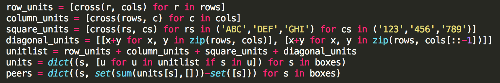

# Artificial Intelligence Nanodegree
## Introductory Project: Diagonal Sudoku Solver

# Question 1 (Naked Twins)
Q: How do we use constraint propagation to solve the naked twins problem?  
A: According to [Wikipedia](https://en.wikipedia.org/wiki/Constraint_satisfaction), constraint propagation works by reducing domains of variables, strengthening constraints, or creating new ones. This leads to a reduction of the search space, making the problem easier to solve. The strategy is to apply the same constraint as many times as possible until a solution is obtained or it reaches the end and no solution is found.

In sudoku, a naked pair is a set of exactly two candidates that are in exactly two squares in a row, column, or block. Using constraint propagation, we try to eliminate or reduce the number of possible values for a square. For the implementation steps, first we identify peer boxes that have only 2 elements. Among these boxes, we look for the boxes that have the same elements (naked twins). Then we can eliminate the corresponding digits from all the boxes that are peers to the naked twins.

# Question 2 (Diagonal Sudoku)
Q: How do we use constraint propagation to solve the diagonal sudoku problem?  
A: To solve the diagonal sudoku problem, we don't really have to change the constraint propagation code because it doesn't take into account where each unit is located. It just needs to know what units it needs to apply the transformation. All we need to do is to add two diagonal additional units to the unitlist so the search can locate the corresponding diagonal entries as peers. See the code snippet below where the diagonal units are being added for the diagonal constraint. 




### Install
This project requires **Python 3**.

We recommend students install [Anaconda](https://www.continuum.io/downloads), a pre-packaged Python distribution that contains all of the necessary libraries and software for this project. 
Please try using the environment we provided in the Anaconda lesson of the Nanodegree.

##### Optional: Pygame

Optionally, you can also install pygame if you want to see your visualization. If you've followed our instructions for setting up our conda environment, you should be all set.

If not, please see how to download pygame [here](http://www.pygame.org/download.shtml).

### Code

* `solutions.py` - You'll fill this in as part of your solution.
* `solution_test.py` - Do not modify this. You can test your solution by running `python solution_test.py`.
* `PySudoku.py` - Do not modify this. This is code for visualizing your solution.
* `visualize.py` - Do not modify this. This is code for visualizing your solution.

### Visualizing

To visualize your solution, please only assign values to the values_dict using the ```assign_values``` function provided in solution.py

### Data

The data consists of a text file of diagonal sudokus for you to solve.